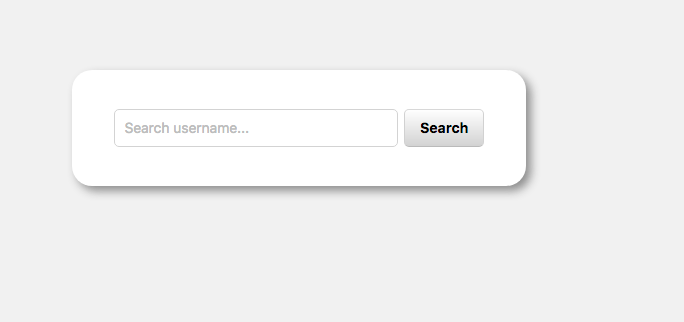
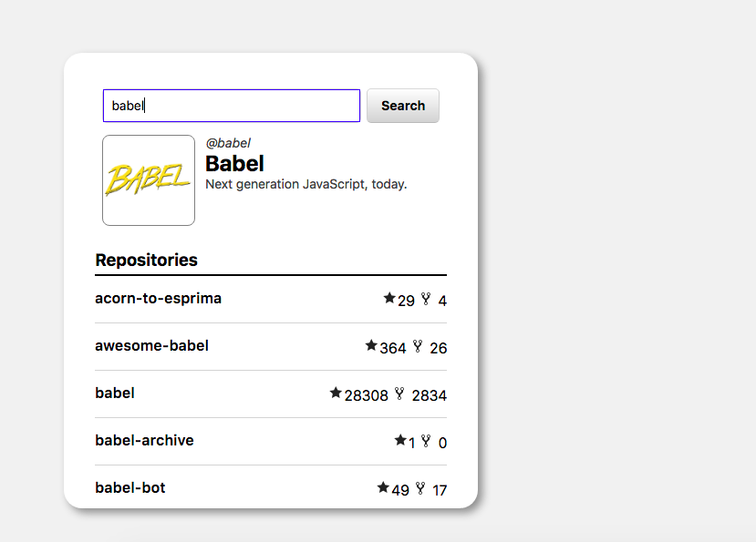

# FrontendTest

## Instructions

[Instructions](./docs/instructions)

## Installing project

Clone or download gitHub repo in your local machine

```sh
git clone https://github.com/EzequielBurgosL/FrontendTest
```

## Opening project

go to the index.html of the app directory...

```sh
cd app/index.html
```

...and copy index.html path link on your navigator.

## Screenshots

### Initial state



### Search



### Empty search


### User not found


